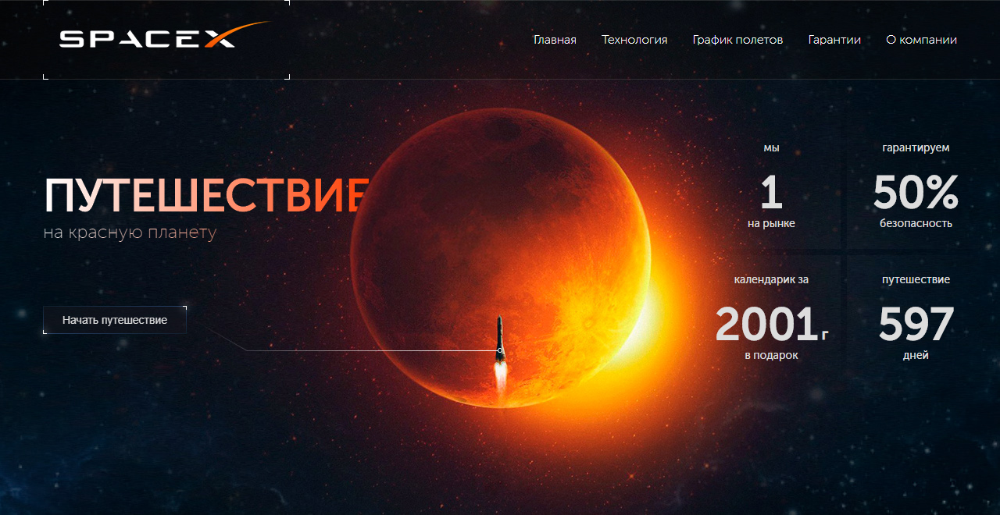

# Space X

This is a fully adaptive and possibly cross browser compatible (tested on latest
chrome, ff, opera, edge, chrome mobile) test task website made with
[tachyons](http://tachyons.io) css framework in ~4 days. Live preview of result
is available [here](https://arkhipzharov.github.io/space-x/)

## 📥 Setup

1. `git clone https://github.com/arkhipzharov/space-x`
2. `yarn install`
3. `git worktree add dist gh-pages`

> Type checking for all files is launched along with commands
> `yarn build` and `yarn dev`

## 👷‍♂ Development

`yarn dev`

## 🌐 Production

> You can read more about this approach
[here](https://medium.com/linagora-engineering/deploying-your-js-app-to-github-pages-the-easy-way-or-not-1ef8c48424b7)

1. `yarn build`
2. `cd dist`
3. `git add .`
4. `git commit`
5. `git push origin gh-pages`
6. wait a bit and check updates [here](https://arkhipzharov.github.io/space-x/)

## Other

- If you meet problems refreshing globally imported scss files or svg sprite cache reload webpack
- Files for debugging are in `.` folder inside chrome dev tools
